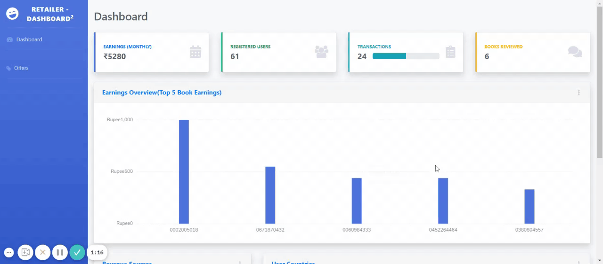

# Theme approach 
 Now a days due to the Growth of Technology Everyone is able to make Buy items online and The Ecommerce Industry is expected to rise in Coming Years .So for this we need a Efficient Ecommerce Recommendation system Where it Suggests Recommendation to users . But In Our Project We Try To recommend the Items to Authors,Publishers and Retailers in such a way so that They will get a personalized Feed back from user reviews. Retailers Can also analyze the Top Trending Books and Focus on them in Personalization for users and send them Exciting Offers which can convert or make user to purchase and We show the Heat map Of users And Give Recommendation based On Demographic Features Also. So In this Way the Retailer gets more profit By Understanding the customer and focusing on their purchase pattern

# document


[Link to docs](https://drive.google.com/file/d/1tqAixFSWiZiUiY9Yk6qspmzdvjxyqrlM/view?usp=drivesdk)

# colab
https://colab.research.google.com/drive/1W3bnFPMFdxa1ExdYQxuYv43k5QzFrG10
https://colab.research.google.com/drive/18xQP5b_7MjMGtxNl-2XgHtH589J69B-K
# To Setup 

 	 1. Actvate virtual environment
  	git lfs clone url 
	python -m venv env
	env\Scripts\activate
	
  	pip install -r requirements.txt
	python main.py
	
# To run 
	Activate 
	source env/bin/activate
	python main.py

# Db Migrate
```
python manager.py db init
python manager.py db migrate
python manager.py db upgrade
```
# Website Demo
<p> 
	<h2>CUSTOMER SITE</h2> 
	
	<h2>RETAILER SITE</h2>
	
	
	
</p>

# Scan the Below QR to visit website 


